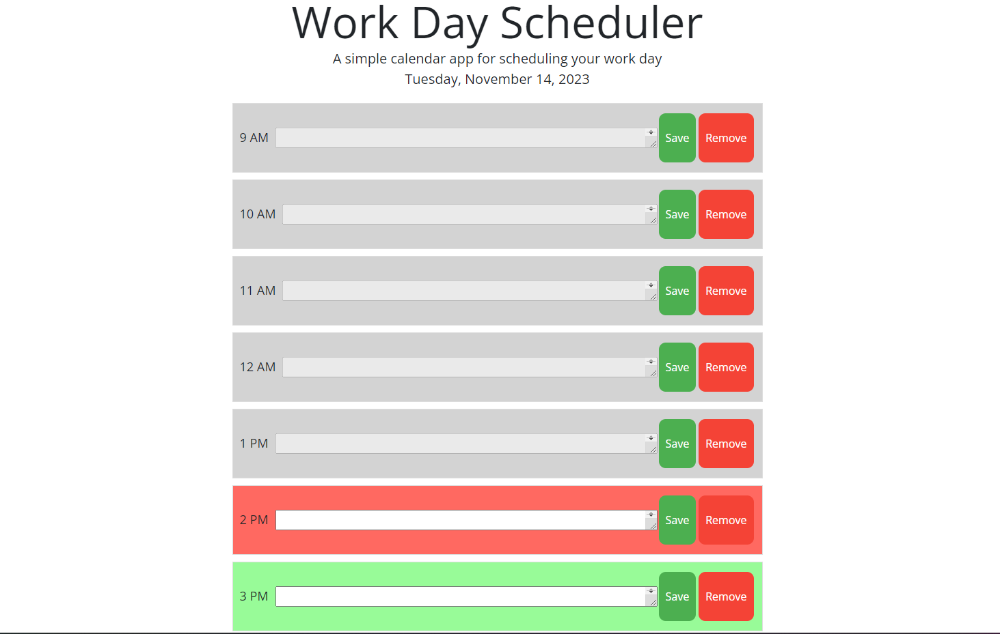
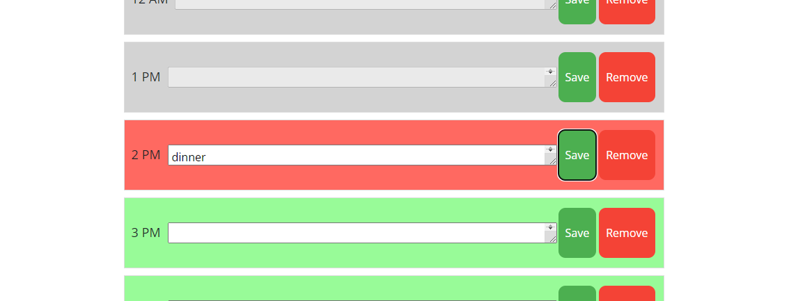
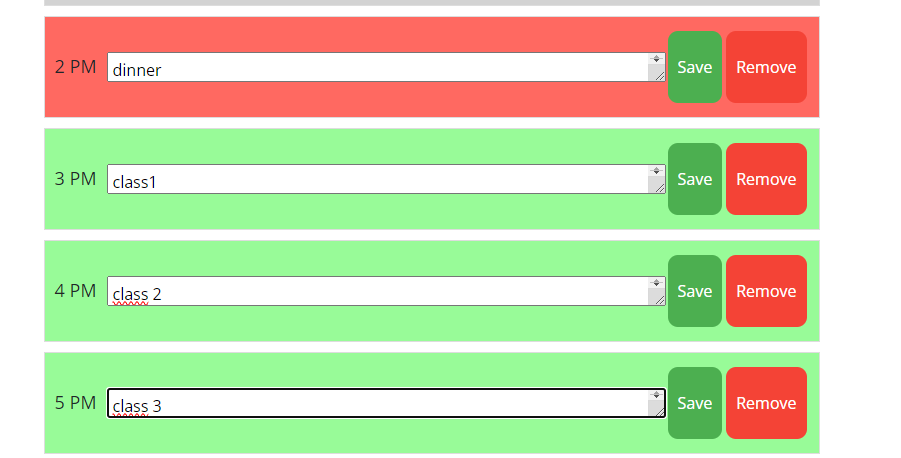

# Dynamic-Calendar-is-amazing

## Photos of app 

## Overview

This is a simple calendar application designed to help users manage their daily schedule effectively. The application allows users to add and save important events for each hour of the workday, providing a visual representation of their tasks. The project is built using HTML, CSS, JavaScript, jQuery, and the Day.js library for date and time functionality.

- **Current Day Display:** The application displays the current day at the top of the calendar, providing users with a quick reference.

- **Timeblocks:** Timeblocks are presented for standard business hours, allowing users to organize their tasks throughout the day.

- **Color-Coding:** Each timeblock is color-coded based on whether it is in the past, present, or future, providing a visual indication of the current time.

- **Event Entry:** Users can click on a timeblock to enter and save events, making it easy to input and manage their schedule.

- **Local Storage:** Events are saved to local storage, ensuring that users' schedules persist between page refreshes.

## Technologies Used

- HTML
- CSS (with Bootstrap for styling)
- JavaScript
- jQuery
- [Day.js](https://day.js.org/) for date and time manipulation

## Links To project

https://github.com/bakomans/Dynamic-Calendar-is-amazing

https://bakomans.github.io/Dynamic-Calendar-is-amazing/